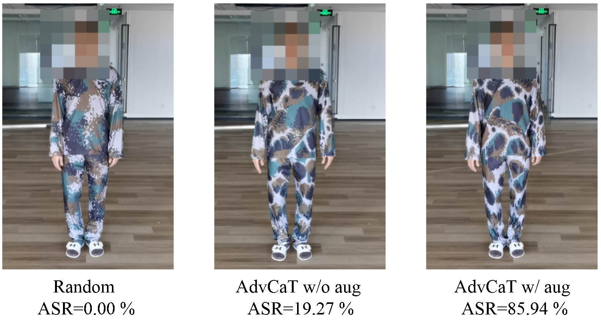
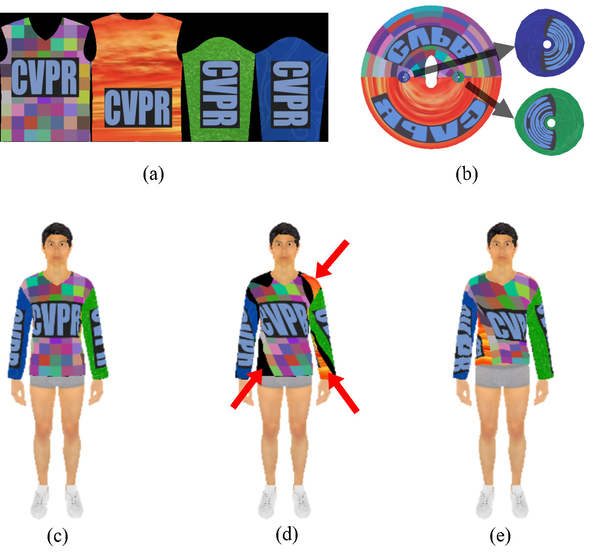
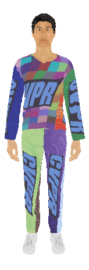
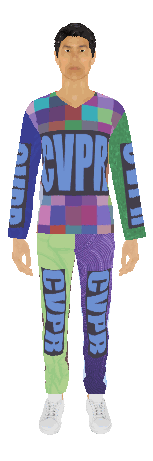

# Physically Realizable Natural-looking Clothing Textures Evade Person Detectors via 3D Modeling

This is the official repository for the paper [Physically Realizable Natural-looking Clothing Textures Evade Person Detectors via 3D Modeling](https://openaccess.thecvf.com/content/CVPR2023/html/Hu_Physically_Realizable_Natural-Looking_Clothing_Textures_Evade_Person_Detectors_via_3D_CVPR_2023_paper.html). See [here](https://github.com/WhoTHU/Zipping) for the Zipping method described in the Supplementary Method. No worries, you don't need to run Zipping for this repo if using the provided objs.

<p align="center">
  
</p>

The 3D clothes models are augmented by the **topologically plausible projection** based on fast 2D augmentation techniques to avoid a substantial 3D computational burden.

<p align="center">
  
</p>

<div style="display: flex; justify-content: center; align-items: center;">
  
  
  
</div>

<!-- toc -->
#### 1. Requirements
All the codes are tested in the following environment:
* Linux (Ubuntu 16.04.6)
* Python 3.8.13
* CUDA 11.0
* PyTorch 1.10.1
* Numpy 1.22.3
* Torchvision 0.11.2
* pytorch3d 0.6.2
* TensorboardX 2.5.1
* Jupyterlab 3.3.2
* Tqdm 4.64.0
* Easydict 1.9

#### 2. Preparation
The data and checkpoints are shared by [Google Drive](https://drive.google.com/file/d/1Uddyu5pjFymjX66AA4HnEKk3fA7r8UVT/view). You need to download it and place the *data* folder in the root directory of this project. If you want to evaluate the checkpoints, place the *results* folder also in the root directory and follow the instructions in the section of [Evaluation](#4-evaluation).

If you are going to use yolov3, you need to download its weights by running
```
./arch/weights/download_weights.sh
```
#### 3. Train
We provide the command to optimize AdvCaT for different target detectors.

##### Faster-RCNN
```
python train.py --nepoch 600 --save_path 'results/rcnn_sr07' --ctrl 50 --arch "rcnn" --seed_type variable --clamp_shift 0.01 --loss_type max_iou --seed_ratio 0.7
```
##### Deformable Detr
```
python train.py --nepoch 600 --save_path 'results/deformable_detr_07' --ctrl 50 --arch "deformable-detr" --seed_type variable --clamp_shift 0.01 --loss_type max_iou --seed_ratio 0.7
```
##### YOLOv3
```
python train.py --nepoch 600 --save_path 'results/yolov3_07' --ctrl 50 --arch "yolov3" --seed_type variable --clamp_shift 0.01 --loss_type max_iou --seed_ratio 0.7
```
#### 4. Evaluation
We provide the command to evaluate AdvCaT and visualize the result. For example, to evaluate the pattern saved in directory 'results/rcnn_sr07' targeting FasterRCNN, run
```
python train.py --device --checkpoint 600 --save_path 'results/rcnn_sr07' --ctrl 50 --arch "rcnn" --seed_type variable --clamp_shift 0.01 --seed_ratio 0.7 --test
```

To visualize the evaluation results, run
```
python visualize.py
```
